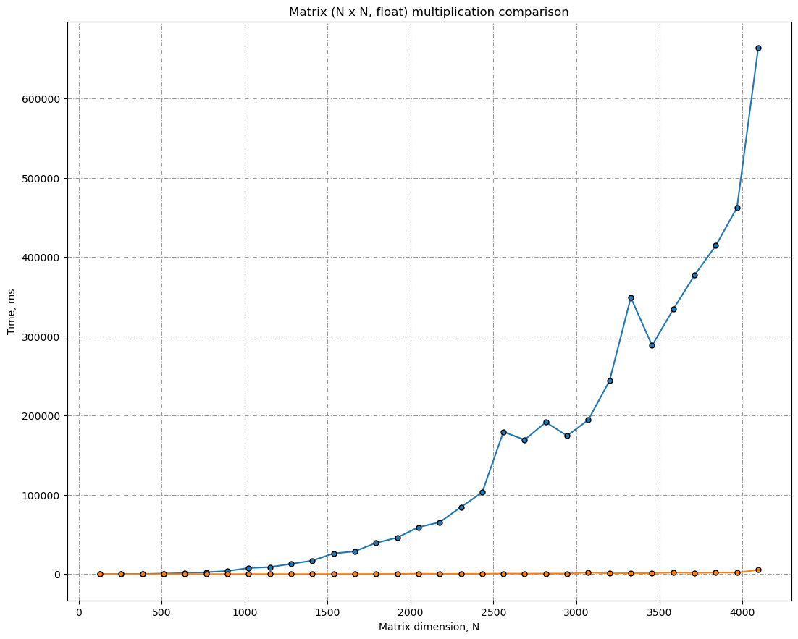
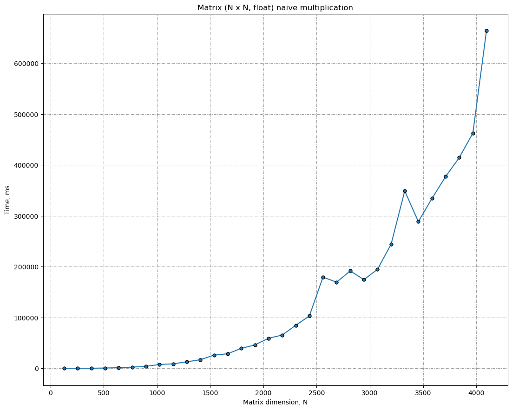
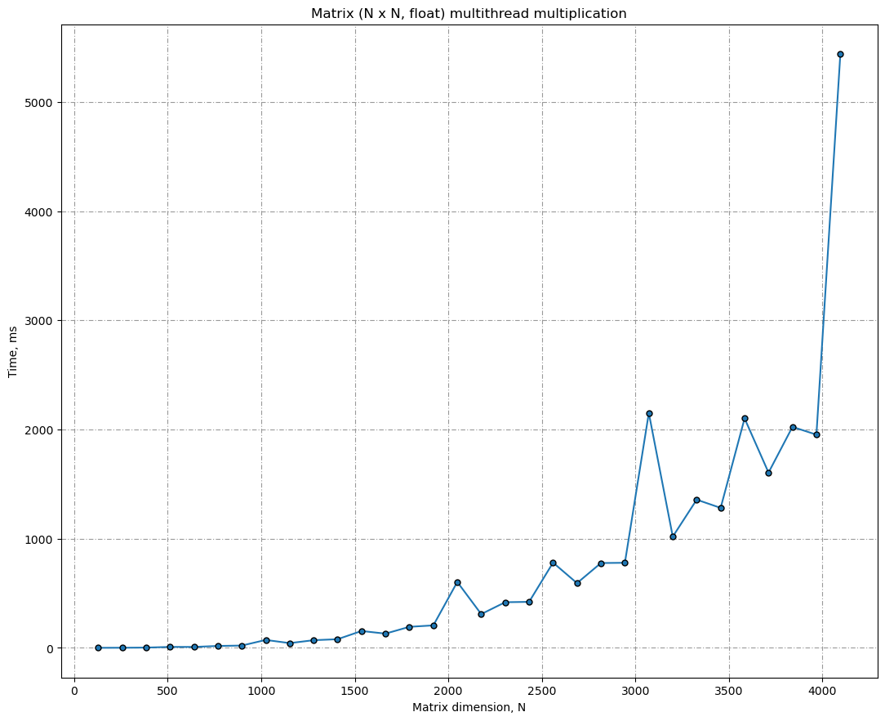
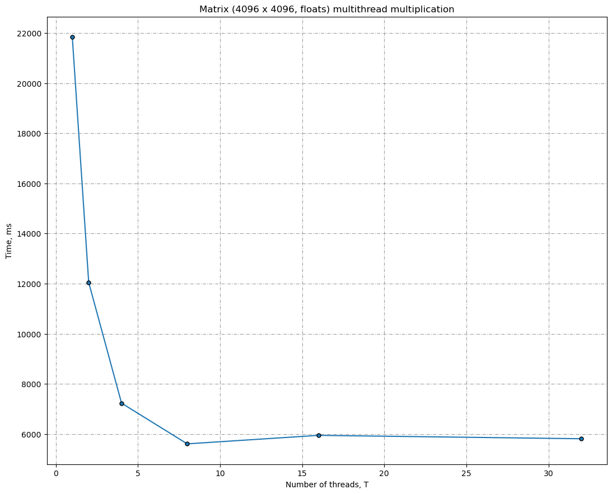

## Сравнение наивного и быстрого перемножения матриц

Репозиторий с 1-м ДЗ на курсе по многопоточному программированию, 2024.

TODO: описание

#### Сравнение

#### Глупое перемножение

#### Умное перемножение

#### Зависимость от числа потоков

